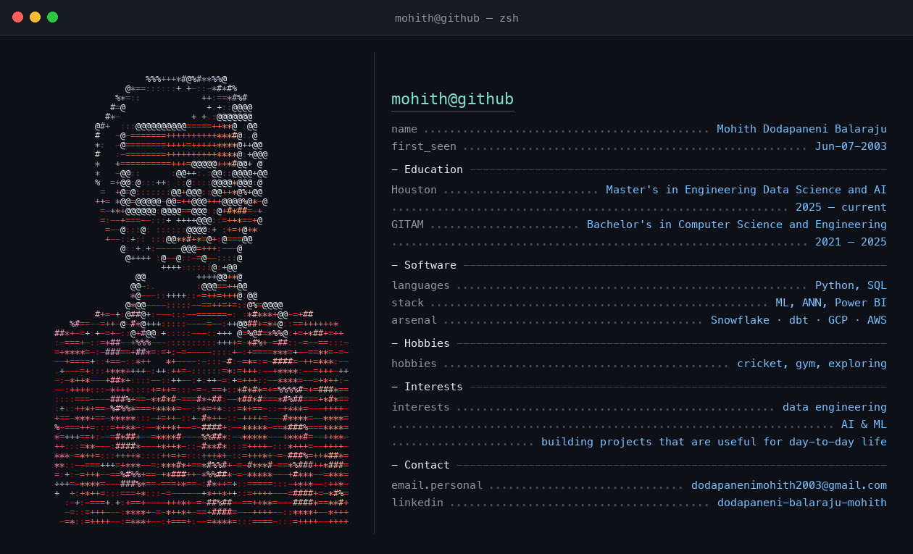

<picture>
  <source media="(prefers-color-scheme: dark)" srcset="assets/profile-dark.png" />
  <source media="(prefers-color-scheme: light)" srcset="assets/profile-light.png" />
  
</picture>

## education

**University of Houston** — Master's in Engineering Data Science and AI  
2025 — current

**GITAM University** — Bachelor's in Computer Science and Engineering  
2021 — 2025

## software

**languages** — Python · SQL

**stack** — ML · ANN · Power BI

**arsenal** — Snowflake · dbt · GCP · AWS

## contact

**personal** — [dodapanenimohith2003@gmail.com](mailto:dodapanenimohith2003@gmail.com)

**linkedin** — [dodapaneni-balaraju-mohith](https://www.linkedin.com/in/dodapaneni-balaraju-mohith/)

## projects

<code>cat ercot-realtime-lakehouse-mlops</code>

 

Realtime ERCOT path: ingest into a Snowflake bronze layer, model silver features with dbt, train a classifier, run a dispatch optimizer, and serve it through an API and dashboard.

[Open the repository](https://github.com/MDB-2003/ercot-realtime-lakehouse-mlops)

<code>cat Telecom_customer_churn_prediction</code>

 

ChurnGuard Pro is a Flask app that scores telecom churn risk with a Random Forest pipeline and returns a probability, a risk level, and a retention action.

[Open the repository](https://github.com/MDB-2003/Telecom_customer_churn_prediction)

<code>cat face-recognition-attendance-system</code>

 

Desktop attendance app. OpenCV detects a face, LBPH recognizes the person, and Tkinter records an id, name, date, and time.

[Open the repository](https://github.com/MDB-2003/face-recognition-attendance-system)

<code>cat Travelling-Website-Front-End</code>

 

Team Adventures, a responsive travel front end with a video hero, destination guides, galleries, and a booking form. Built during a web internship at Phoenix Global, May–June 2024.

[Open the repository](https://github.com/MDB-2003/Travelling-Website-Front-End)

 

<a href="https://github.com/MDB-2003?tab=repositories">
  <picture>
    <source media="(prefers-color-scheme: dark)" srcset="assets/see-projects-dark.svg" />
    <source media="(prefers-color-scheme: light)" srcset="assets/see-projects-light.svg" />
    
  </picture>
</a>
